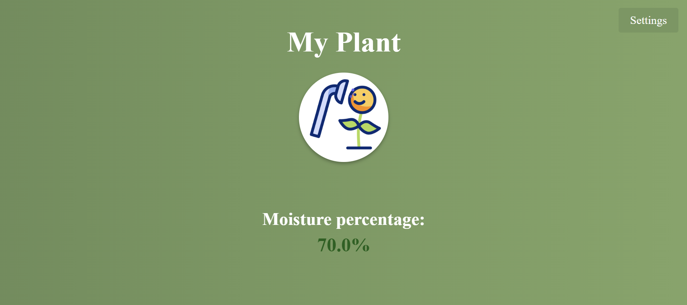
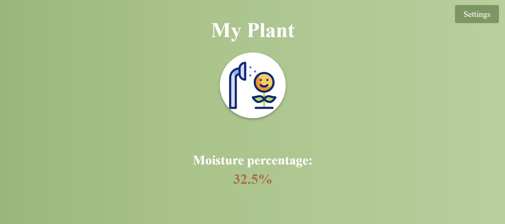
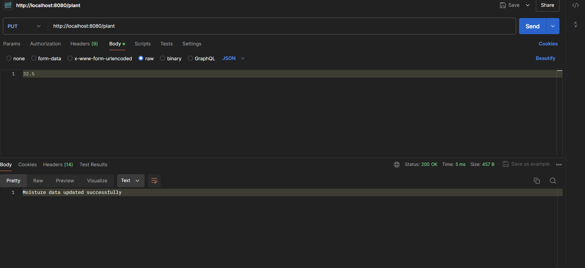
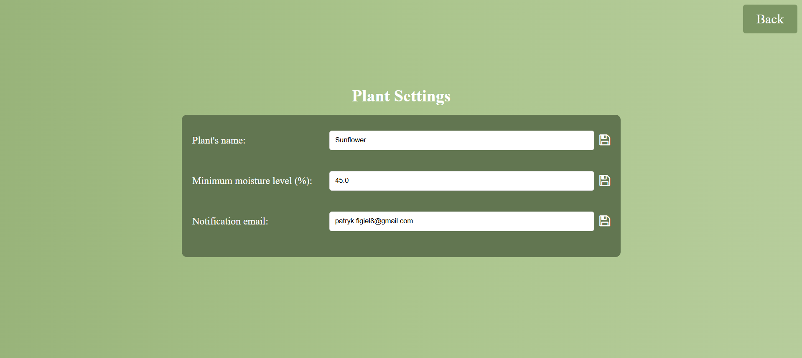
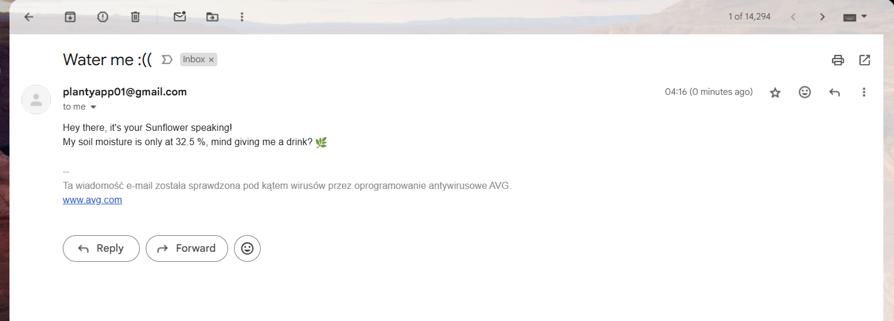

# Plantie - Soil Moisture Monitoring Application
Plantie is a web application built with Spring Boot that monitors soil moisture levels using an Arduino sensor. The sensor sends data to this application, which displays real-time moisture levels and sends email notifications when moisture drops below a user-defined threshold. The email notifications are personalized with the plant's name, which the user can configure.

## Features:
- Receives real-time soil moisture data from an Arduino sensor
- Displays the moisture percentage on a web interface
- Allows users to configure a minimum moisture threshold
- Sends personalized email alerts when moisture drops below the threshold
- Provides a settings page to update plant information and email preferences

## Technologies:
- **Backend:** Java Spring Boot
- **Frontend:** Thymeleaf, HTML, CSS, JavaScript
- **Hardware:** Arduino with a soil moisture sensor
- **Email Notifications:** JavaMailSender

## Installation and Running:
- **Clone the repository:**
```bash
git clone https://github.com/user/plantie-app.git
cd plantie-app`
```
- **Install dependencies:**
```bash
mvn clean install
```
- **Run the application:**
```bash
mvn spring-boot:run
```
- **Open in browser: http://localhost:8080**

## How It Works:
- The Arduino soil moisture sensor sends data to the application 
- The application updates the moisture percentage displayed on the web interface
- Users can configure a minimum moisture threshold in the settings page
- If the moisture level drops below the threshold, an email notification is sent
- The email contains a personalized message including the plant’s name
- The system continuously checks moisture levels at fixed intervals

## API Endpoints

| Method | Endpoint         | Description                                  |
|--------|------------------|----------------------------------------------|
| GET    | /plant           | Retrieves the current soil moisture level    |
| PUT    | /plant           | Updates the soil moisture level received from the sensor |
| GET    | /settings        | Displays the settings page                   |
| POST   | /settings/update | Updates plant information and notification settings |

## Screenshots:
Below are some screenshots of the **Plantie** web application in action:

1. **Main page of the application:**
   

2. **Changing the text color based on moisture level:**
   

3. **Simulating data sent via Postman to update the moisture level in the application:**
   

4. **Application settings page:**
   

5. **Email notification:**
   


